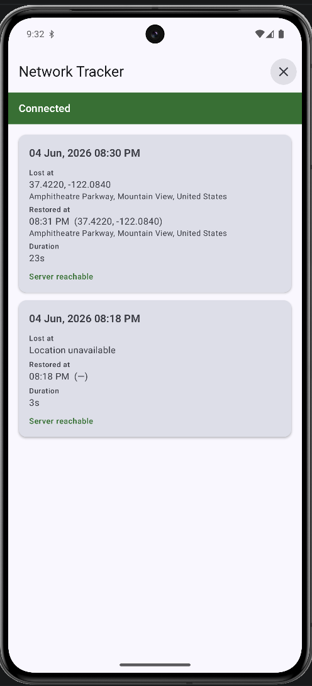

# Network Location Tracker

Ever lost signal on a train, in a tunnel, or in that one dead corner of your
apartment - and wished your phone just *remembered* it for you? That's what this
app does. It quietly keeps an eye on your connection and, whenever the network
drops, it writes down **where you were, when it happened, how long it lasted, and
where you were when it came back.**

It's built as my final project for **KT Academy's Advanced Kotlin Coroutines**
course, so under the hood it's really a showcase of Flow, structured concurrency,
and testing coroutine-based code - wrapped in something that's actually useful.

## What it does

- Watches connectivity in the background through a **foreground service**, so
  tracking keeps working even when the app isn't on screen.
- Tells the difference between "the phone says it's connected" and "the internet
  actually works" by probing Google's DNS server (`8.8.8.8`).
- Records each outage as a tidy entry: start time + place, end time + place, total
  duration, and whether the server was reachable.
- Reverse-geocodes coordinates into human-readable addresses where it can, and
  still records the outage as "Location unavailable" when no GPS fix is available.
- Keeps everything **offline** in a local Room database - no backend, no sync, no
  account.

## What it looks like

One screen, on purpose:

- A **status banner** at the top showing your current connection state.
- A **scrolling list** of past outages underneath.
- Start/stop tracking, and a clear-all button.

No map, no detail pages - the scope is deliberately kept tight so the focus stays
on the coroutine work.

<p align="center">
  
</p>

Each entry records where and when the connection dropped, where and when it came
back, how long it lasted, and whether the server was reachable - falling back to
"Location unavailable" when no GPS fix was available at the time.

## How it's built

Clean-architecture layering, MVI on the presentation side:

| Layer | Highlights |
|-------|-----------|
| **Domain** | `NetworkChecker`, `ServerPinger`, `LocationObserver`, `AddressResolver`, `NetworkOutageRepository`, typed `Result` / `DataError` |
| **Data** | Room database + DAO + mapper, `IcmpServerPinger`, `LocationObserverImpl`, `GeocoderAddressResolver`, offline repository |
| **Coroutines core** | `NetworkWithLocationTracker` - `flatMapLatest` switches connectivity into server-reachability polling, with `distinctUntilChanged`, `catch`, `flowOn`. Status is published instantly via `StateFlow`, while each connectivity transition is queued onto a `Channel` and drained by a single ordered consumer that attaches a best-effort location before persisting - so a brief outage is never dropped while waiting for GPS. Tracking results surface on a `SharedFlow`. |
| **Presentation** | `NetworkTrackerListViewModel` (MVI: `StateFlow` state + `Channel` events, survives process death via `SavedStateHandle`) and a Compose screen |
| **Service** | `NetworkTrackerService` - a foreground service with an ongoing notification and a stop action |

**Stack:** Kotlin · Coroutines & Flow · Jetpack Compose · Room · Koin (DI) ·
kotlinx-datetime · JUnit5 · Turbine · AssertK · kotlinx-coroutines-test.

- `minSdk` 24, `targetSdk` 35.
- Android 14+ requires `FOREGROUND_SERVICE_LOCATION`, so the app asks for location
  + notification permissions on first launch.

## Running it

You'll need Android Studio (or just the SDK + JDK 11) and a device/emulator.

```bash
# build a debug APK
./gradlew assembleDebug

# install onto a connected device/emulator
./gradlew installDebug
```

On first launch, grant the **location** and **notifications** permissions, hit
**Start tracking**, and the foreground notification will appear. Toggle airplane
mode (or walk into your dead spot) to see an outage get recorded, then come back
online to watch it close out with a duration.

## Testing

The interesting logic - the Flow pipeline, the ViewModel, the ping retry behaviour,
and the data mapper - is covered by **25 fast JVM unit tests**. No device or
emulator required; they run entirely on the host using `kotlinx-coroutines-test`
(`runTest`, virtual time) with Turbine for asserting on flows.

**The smoke test - run this before you trust a build:**

```bash
./gradlew testDebugUnitTest
```

`BUILD SUCCESSFUL` means all 25 are green. Helpful variations:

```bash
./gradlew testDebugUnitTest --info     # see each test as it runs
./gradlew assembleDebug                 # compile-only sanity check
./gradlew check                         # tests + lint, the thorough pass
```

What's covered:

- **`NetworkWithLocationTrackerTest`** (13) - the heart of it: connect/disconnect
  transitions, starting and completing outages (including with no location and
  brief outages that must not be dropped), server reachability polling, and error
  paths.
- **`NetworkTrackerListViewModelTest`** (6) - state updates, events, tracking
  toggle, process-death restoration.
- **`IcmpServerPingerTest`** (3) - ping success, failure, and retry behaviour.
- **`NetworkOutageMapperTest`** (3) - entity ⇄ domain round-trips, including
  outages with no coordinates.

There are no instrumented/Compose UI tests by design - the brief is about
coroutines, not UI automation.
